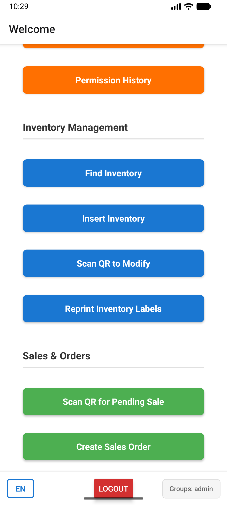

# Car Tire Sales (Expo / React Native)

Lightweight point-of-sale mobile app for car tire shops built with Expo and Appwrite backend utilities.

## Highlights
- Expo + React Native frontend
- Appwrite backend integrations
- Permission and sync utilities, offline support

## Tech stack
- React Native (Expo)
- TypeScript
- Appwrite (backend)
- Node.js / npm

## Development Setup

### Prerequisites
- **Node.js 18+** (install via [nvm](https://github.com/nvm-sh/nvm) — recommended):
  ```bash
  curl -fsSL https://raw.githubusercontent.com/nvm-sh/nvm/v0.39.6/install.sh | bash
  nvm install --lts
  nvm use --lts
  ```

### Install & Run
1. Copy environment variables from `.env.example` to `.env` and fill with your values.
2. Install dependencies (use `--legacy-peer-deps` for React 19 compatibility):
   ```bash
   npm install --legacy-peer-deps
   ```

3. Start Expo in development mode:
   ```bash
   npx expo start
   # or: npm start
   ```

4. Validate code before committing:
   ```bash
   npm run check        # TypeScript type-check
   npm run lint         # ESLint (may require fresh install)
   npm run test:ci      # Run tests in CI mode
   ```

## Environment
- This repository does NOT include secret `.env` files. Use `.env.example` as a template.
- Keep production keys out of GitHub. If you accidentally commit secrets, rotate them and remove from history.

## Files of interest
- App entry: `app/index.tsx`
- Components: `components/`
- Scripts and setup helpers: `scripts/`, `setup-*.sh`

## Contributing
- Please open issues or pull requests. Add tests for new functionality.

## Screenshot / Demo
Below is a demo screenshot captured from the emulator:



## License
MIT License — see [LICENSE](LICENSE) for details.
